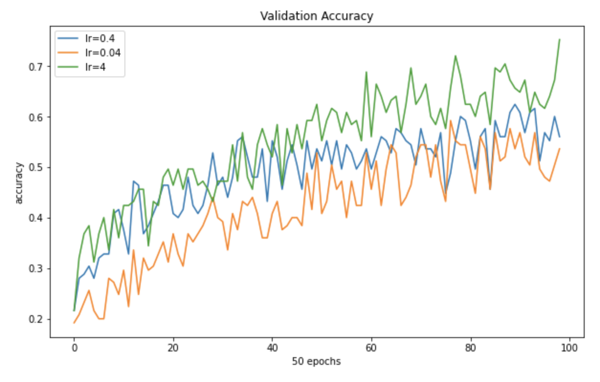
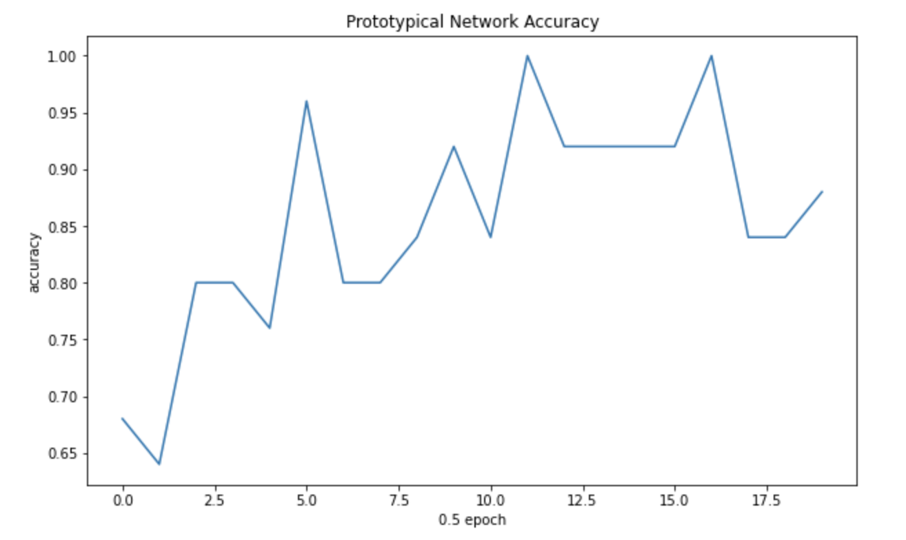

CS330 Autumn 2020 Homework 2

*Model-Agnostic Meta-Learning and Prototypical Networks*

SUNet ID: yyhhli;

Name: Yiheng Li

## Code Link:

https://drive.google.com/file/d/1dYpzXQC1xu4K1ckStqeAn5l6jPv4q4yj/view?usp=sharing

### Problem 1

1. (See whole block in code link)

```python

def meta_train_fn(model, exp_string, data_generator,
               n_way=5, meta_train_iterations=15000, meta_batch_size=25,
               log=True, logdir='/tmp/data', k_shot=1, num_inner_updates=1, meta_lr=0.001):
  SUMMARY_INTERVAL = 10
  SAVE_INTERVAL = 100
  PRINT_INTERVAL = 10  
  TEST_PRINT_INTERVAL = PRINT_INTERVAL*5

  pre_accuracies, post_accuracies = [], []

  num_classes = data_generator.num_classes

  optimizer = tf.keras.optimizers.Adam(learning_rate=meta_lr)

  for itr in range(meta_train_iterations):
    #############################
    #### YOUR CODE GOES HERE ####

    # sample a batch of training data and partition into
    # the support/training set (input_tr, label_tr) and the query/test set (input_ts, label_ts)
    # NOTE: The code assumes that the support and query sets have the same number of examples.
    image_batch, label_batch = data_generator.sample_batch('meta_train', meta_batch_size)
    input_tr, input_ts = image_batch[:,:,:k_shot,:], image_batch[:,:,k_shot:,:]
    label_tr, label_ts = label_batch[:,:,:k_shot,:], label_batch[:,:,k_shot:,:]
    # modify label shape to be [B, N*K, N]
    label_tr = label_tr.reshape((label_tr.shape[0], label_tr.shape[1] * label_tr.shape[2], label_tr.shape[3]))
    label_ts = label_ts.reshape((label_ts.shape[0], label_ts.shape[1] * label_ts.shape[2], label_ts.shape[3]))
    #############################

    inp = (input_tr, input_ts, label_tr, label_ts)
    
    result = outer_train_step(inp, model, optimizer, meta_batch_size=meta_batch_size, num_inner_updates=num_inner_updates)

    if itr % SUMMARY_INTERVAL == 0:
      pre_accuracies.append(result[-2])
      post_accuracies.append(result[-1][-1])

    if (itr!=0) and itr % PRINT_INTERVAL == 0:
      print_str = 'Iteration %d: pre-inner-loop train accuracy: %.5f, post-inner-loop test accuracy: %.5f' % (itr, np.mean(pre_accuracies), np.mean(post_accuracies))
      print(print_str)
      pre_accuracies, post_accuracies = [], []

    if (itr!=0) and itr % TEST_PRINT_INTERVAL == 0:
      #############################
      #### YOUR CODE GOES HERE ####

      # sample a batch of validation data and partition it into
      # the support/training set (input_tr, label_tr) and the query/test set (input_ts, label_ts)
      # NOTE: The code assumes that the support and query sets have the same number of examples.
      image_val, label_val = data_generator.sample_batch('meta_val', meta_batch_size)
      input_tr, input_ts = image_val[:,:,:k_shot,:], image_val[:,:,k_shot:,:]
      label_tr, label_ts = label_val[:,:,:k_shot,:], label_val[:,:,k_shot:,:]
      # modify label shape to be [B, N*K, N]
      label_tr = label_tr.reshape((label_tr.shape[0], label_tr.shape[1] * label_tr.shape[2], label_tr.shape[3]))
      label_ts = label_ts.reshape((label_ts.shape[0], label_ts.shape[1] * label_ts.shape[2], label_ts.shape[3]))
      #############################

      inp = (input_tr, input_ts, label_tr, label_ts)
      result = outer_eval_step(inp, model, meta_batch_size=meta_batch_size, num_inner_updates=num_inner_updates)

      print('Meta-validation pre-inner-loop train accuracy: %.5f, meta-validation post-inner-loop test accuracy: %.5f' % (result[-2], result[-1][-1]))

  model_file = logdir + '/' + exp_string +  '/model' + str(itr)
  print("Saving to ", model_file)
  model.save_weights(model_file)

# calculated for omniglot
NUM_META_TEST_POINTS = 600

def meta_test_fn(model, data_generator, n_way=5, meta_batch_size=25, k_shot=1,
              num_inner_updates=1):
  
  num_classes = data_generator.num_classes

  np.random.seed(1)
  random.seed(1)

  meta_test_accuracies = []

  for _ in range(NUM_META_TEST_POINTS):
    #############################
    #### YOUR CODE GOES HERE ####

    # sample a batch of test data and partition it into
    # the support/training set (input_tr, label_tr) and the query/test set (input_ts, label_ts)
    # NOTE: The code assumes that the support and query sets have the same number of examples.
    image_tst, label_tst = data_generator.sample_batch('meta_test', meta_batch_size)
    input_tr, input_ts = image_tst[:,:,:k_shot,:], image_tst[:,:,k_shot:,:]
    label_tr, label_ts = label_tst[:,:,:k_shot,:], label_tst[:,:,k_shot:,:]
    # modify label shape to be [B, N*K, N]
    label_tr = label_tr.reshape((label_tr.shape[0], label_tr.shape[1] * label_tr.shape[2], label_tr.shape[3]))
    label_ts = label_ts.reshape((label_ts.shape[0], label_ts.shape[1] * label_ts.shape[2], label_ts.shape[3]))
    #############################
    inp = (input_tr, input_ts, label_tr, label_ts)
    result = outer_eval_step(inp, model, meta_batch_size=meta_batch_size, num_inner_updates=num_inner_updates)

    meta_test_accuracies.append(result[-1][-1])

  meta_test_accuracies = np.array(meta_test_accuracies)
  means = np.mean(meta_test_accuracies)
  stds = np.std(meta_test_accuracies)
  ci95 = 1.96*stds/np.sqrt(NUM_META_TEST_POINTS)

  print('Mean meta-test accuracy/loss, stddev, and confidence intervals')
  print((means, stds, ci95))
```

2. (See whole block in code link)

```python

class MAML(tf.keras.Model):
  def __init__(self, dim_input=1, dim_output=1,
               num_inner_updates=1,
               inner_update_lr=0.4, num_filters=32, k_shot=5, learn_inner_update_lr=False):
    super(MAML, self).__init__()
    self.dim_input = dim_input
    self.dim_output = dim_output
    self.inner_update_lr = inner_update_lr
    self.loss_func = partial(cross_entropy_loss, k_shot=k_shot)
    self.dim_hidden = num_filters
    self.channels = 1
    self.img_size = int(np.sqrt(self.dim_input/self.channels))

    # outputs_ts[i] and losses_ts_post[i] are the output and loss after i+1 inner gradient updates
    losses_tr_pre, outputs_tr, losses_ts_post, outputs_ts = [], [], [], []
    accuracies_tr_pre, accuracies_ts = [], []

    # for each loop in the inner training loop
    outputs_ts = [[]]*num_inner_updates
    losses_ts_post = [[]]*num_inner_updates
    accuracies_ts = [[]]*num_inner_updates

    # Define the weights - these should NOT be directly modified by the
    # inner training loop
    tf.random.set_seed(seed)
    self.conv_layers = ConvLayers(self.channels, self.dim_hidden, self.dim_output, self.img_size)

    self.learn_inner_update_lr = learn_inner_update_lr
    if self.learn_inner_update_lr:
      #print("Hey")
      self.inner_update_lr_dict = {}
      for key in self.conv_layers.conv_weights.keys():
        self.inner_update_lr_dict[key] = [tf.Variable(self.inner_update_lr, name='inner_update_lr_%s_%d' % (key, j)) for j in range(num_inner_updates)]
  
  @tf.function
  def call(self, inp, meta_batch_size=25, num_inner_updates=1):
    def task_inner_loop(inp, reuse=True,
                      meta_batch_size=25, num_inner_updates=1):
      """
        Perform gradient descent for one task in the meta-batch (i.e. inner-loop).
        Args:
          inp: a tuple (input_tr, input_ts, label_tr, label_ts), where input_tr and label_tr are the inputs and
            labels used for calculating inner loop gradients and input_ts and label_ts are the inputs and
            labels used for evaluating the model after inner updates.
            Should be shapes:
              input_tr: [N*K, 784]
              input_ts: [N*K, 784]
              label_tr: [N*K, N]
              label_ts: [N*K, N]
        Returns:
          task_output: a list of outputs, losses and accuracies at each inner update
      """
      # the inner and outer loop data
      input_tr, input_ts, label_tr, label_ts = inp

      # weights corresponds to the initial weights in MAML (i.e. the meta-parameters)
      weights = self.conv_layers.conv_weights

      # the predicted outputs, loss values, and accuracy for the pre-update model (with the initial weights)
      # evaluated on the inner loop training data
      task_output_tr_pre, task_loss_tr_pre, task_accuracy_tr_pre = None, None, None

      # lists to keep track of outputs, losses, and accuracies of test data for each inner_update
      # where task_outputs_ts[i], task_losses_ts[i], task_accuracies_ts[i] are the output, loss, and accuracy
      # after i+1 inner gradient updates
      task_outputs_ts, task_losses_ts, task_accuracies_ts = [], [], []
  
      #############################
      #### YOUR CODE GOES HERE ####
      # perform num_inner_updates to get modified weights
      # modified weights should be used to evaluate performance
      # Note that at each inner update, always use input_tr and label_tr for calculating gradients
      # and use input_ts and labels for evaluating performance

      # HINTS: You will need to use tf.GradientTape().
      # Read through the tf.GradientTape() documentation to see how 'persistent' should be set.
      # Here is some documentation that may be useful: 
      # https://www.tensorflow.org/guide/advanced_autodiff#higher-order_gradients
      # https://www.tensorflow.org/api_docs/python/tf/GradientTape
      with tf.GradientTape(persistent=True) as inner_tape:
        new_weights = weights.copy()
        # inner_tape.watch(new_weights)
        # calculate pres before updating weights
        for inner_update in range(num_inner_updates):
          # calculate result and gradient using Dtr
          preds_tr = self.conv_layers(input_tr, weights)
          loss = self.loss_func(preds_tr, label_tr)
          gradients = inner_tape.gradient(loss, weights)
          acc_tr = accuracy(label_tr, preds_tr)
          # if the first round without updating weights, fill in the "pre"s
          if task_output_tr_pre is None:
            task_output_tr_pre, task_loss_tr_pre, task_accuracy_tr_pre = preds_tr, loss, acc_tr
          # update "new_weights"
          try:
            for key_w, key_grads in zip(weights, gradients):
              new_weights[key_w] = weights[key_w] - tf.math.multiply(gradients[key_grads], self.inner_update_lr_dict[key_grads])
          except AttributeError:
            # print("No dict")
            for key_w, key_grads in zip(weights, gradients):
              new_weights[key_w] = weights[key_w] - gradients[key_grads] * self.inner_update_lr
          # use updated weights to evaluate
          preds_ts = self.conv_layers(input_ts, new_weights)
          loss_ts = self.loss_func(preds_ts, label_ts)
          acc_ts = accuracy(label_ts, preds_ts)
          # record the values
          # tf.print("print preds", preds_ts)
          task_outputs_ts.append(preds_ts)
          task_losses_ts.append(loss_ts)
      #############################
      # Compute accuracies from output predictions
      task_accuracy_tr_pre = accuracy(tf.argmax(input=label_tr, axis=1), tf.argmax(input=tf.nn.softmax(task_output_tr_pre), axis=1))
      for j in range(num_inner_updates):
        task_accuracies_ts.append(accuracy(tf.argmax(input=label_ts, axis=1), tf.argmax(input=tf.nn.softmax(task_outputs_ts[j]), axis=1)))
      task_output = [task_output_tr_pre, task_outputs_ts, task_loss_tr_pre, task_losses_ts, task_accuracy_tr_pre, task_accuracies_ts]

      return task_output

    input_tr, input_ts, label_tr, label_ts = inp
    # to initialize the batch norm vars, might want to combine this, and not run idx 0 twice.
    unused = task_inner_loop((input_tr[0], input_ts[0], label_tr[0], label_ts[0]),
                          False,
                          meta_batch_size,
                          num_inner_updates)
    out_dtype = [tf.float32, [tf.float32]*num_inner_updates, tf.float32, [tf.float32]*num_inner_updates]
    out_dtype.extend([tf.float32, [tf.float32]*num_inner_updates])
    task_inner_loop_partial = partial(task_inner_loop, meta_batch_size=meta_batch_size, num_inner_updates=num_inner_updates)
    result = tf.map_fn(task_inner_loop_partial,
                    elems=(input_tr, input_ts, label_tr, label_ts),
                    dtype=out_dtype,
                    parallel_iterations=meta_batch_size)
    return result
```

3. *NOTE: epochs of meta-train has been limited to be 6500 for the sake of training time*

   1. >submit a plot of the validation accuracy over iterations as well as the
      >number of the average test accuracy.

      

   $$\text{meta_test_accuracy}_{lr=0.4}=0.6223;\text{stddev}_{lr=0.4}=0.1897; \\ \text{meta_test_accuracy}_{lr=0.04}=0.5433;\text{stddev}_{lr=0.04}=0.1893; \\ \text{meta_test_accuracy}_{lr=4}=0.6703;\text{stddev}_{lr=4}=0.1838;$$

   

   

   1. >Can you briefly explain why different values of inner update lr would affect meta-training?

      Inner update learning rate determines how large the "step" the model should take for "fine-tuning" for each meta task, which definitely matters as the epoch is fixed to be 1, which requires the model to learn in just one step.

4. Submit a plot of the meta-validation accuracy over meta-training iterations and state
   how it compares to the MAML with fixed inner update lr.
   
   
   
   
   
   

It's learning faster than `lr=0.04` and `lr=0.4`, but slightly slower than `lr=4`. Dynamically learning `lr` is **better** than fixed inner update `lr`, because it learned to adjust the learning rate to the most suitable place regardless of the starting learning rate. So it would have the comparable performance with the performance of models where the best learning rate has been chosen.

### Problem 2

1. (See whole block in code link)

```python

def run_protonet(data_path='./omniglot_resized', n_way=20, k_shot=1, n_query=5, n_meta_test_way=20, k_meta_test_shot=5, n_meta_test_query=5):
  n_epochs = 10
  n_episodes = 100

  im_width, im_height, channels = 28, 28, 1
  num_filters = 32
  latent_dim = 16
  num_conv_layers = 3
  n_meta_test_episodes = 1000

  model = ProtoNet([num_filters]*num_conv_layers, latent_dim)
  optimizer = tf.keras.optimizers.Adam()

    # call DataGenerator with k_shot+n_query samples per class
    # image batch has shape [B, N, K, 784] and label batch has shape [B, N, K, N]
  data_generator = DataGenerator(n_way, k_shot+n_query, n_meta_test_way, k_meta_test_shot+n_meta_test_query)
  for ep in range(n_epochs):
    for epi in range(n_episodes):
      #############################
      #### YOUR CODE GOES HERE ####

      # sample a batch of training data and partition it into
      # support and query sets
      image, label = data_generator.sample_batch('meta_train', 1, shuffle=False)
      s_flatten, q_flatten = image[:,:,:k_shot,:], image[:,:,k_shot:,:]
      labels = label
      # reshape them into [num_classes, num_support, im_height, im_width, channels]
      support = np.reshape(np.squeeze(s_flatten, axis=0), newshape=(s_flatten.shape[1], s_flatten.shape[2], 
                                                                 im_height, im_height, channels))
      query = np.reshape(np.squeeze(q_flatten, axis=0), newshape=(q_flatten.shape[1], q_flatten.shape[2],
                                                               im_height, im_height, channels))
      #############################
      ls, ac = proto_net_train_step(model, optimizer, x=support, q=query, labels_ph=labels)
      if (epi+1) % 50 == 0:
        #############################
        #### YOUR CODE GOES HERE ####
        # sample a batch of validation data and partition it into
        # support and query sets
        image_val, label_val = data_generator.sample_batch('meta_val', 1, shuffle=True)
        s_flatten, q_flatten = image_val[:,:,:k_shot,:], image_val[:,:,k_shot:,:]
        labels = label_val
        # reshape them into [num_classes, num_support, im_height, im_width, channels]
        support = np.reshape(np.squeeze(s_flatten, axis=0), newshape=(s_flatten.shape[1], s_flatten.shape[2], 
                                                                 im_height, im_height, channels))
        query = np.reshape(np.squeeze(q_flatten, axis=0), newshape=(q_flatten.shape[1], q_flatten.shape[2],
                                                               im_height, im_height, channels))
        #############################
        val_ls, val_ac = proto_net_eval(model, x=support, q=query, labels_ph=labels)
        print('[epoch {}/{}, episode {}/{}] => meta-training loss: {:.5f}, meta-training acc: {:.5f}, meta-val loss: {:.5f}, meta-val acc: {:.5f}'.format(ep+1,
                                                                    n_epochs,
                                                                    epi+1,
                                                                    n_episodes,
                                                                    ls,
                                                                    ac,
                                                                    val_ls,
                                                                    val_ac))

  print('Testing...')
  meta_test_accuracies = []
  for epi in range(n_meta_test_episodes):
    #############################
    #### YOUR CODE GOES HERE ####

    # sample a batch of test data and partition it into
    # support and query sets
    image_test, label_test = data_generator.sample_batch('meta_test', 1, shuffle=True)
    s_flatten, q_flatten = image_test[:,:,:k_meta_test_shot,:], image_test[:,:,k_meta_test_shot:,:]
    labels = label_test
    # reshape them into [num_classes, num_support, im_height, im_width, channels]
    support = np.reshape(np.squeeze(s_flatten, axis=0), newshape=(s_flatten.shape[1], s_flatten.shape[2], 
                                                              im_height, im_height, channels))
    query = np.reshape(np.squeeze(q_flatten, axis=0), newshape=(q_flatten.shape[1], q_flatten.shape[2],
                                                            im_height, im_height, channels))
    #############################
    ls, ac = proto_net_eval(model, x=support, q=query, labels_ph=labels)
    meta_test_accuracies.append(ac)
    if (epi+1) % 50 == 0:
      print('[meta-test episode {}/{}] => loss: {:.5f}, acc: {:.5f}'.format(epi+1, n_meta_test_episodes, ls, ac))
  avg_acc = np.mean(meta_test_accuracies)
  stds = np.std(meta_test_accuracies)
  print('Average Meta-Test Accuracy: {:.5f}, Meta-Test Accuracy Std: {:.5f}'.format(avg_acc, stds))
```

2. (See whole block in code link)

```python

def ProtoLoss(x_latent, q_latent, labels_onehot, num_classes, num_support, num_queries):
  """
    calculates the prototype network loss using the latent representation of x
    and the latent representation of the query set
    Args:
      x_latent: latent representation of supports with shape [N*S, D], where D is the latent dimension
      q_latent: latent representation of queries with shape [N*Q, D], where D is the latent dimension
      labels_onehot: one-hot encodings of the labels of the queries with shape [N, Q, N]
      num_classes: number of classes (N) for classification
      num_support: number of examples (S) in the support set
      num_queries: number of examples (Q) in the query set
    Returns:
      ce_loss: the cross entropy loss between the predicted labels and true labels
      acc: the accuracy of classification on the queries
  """
  #############################
  #### YOUR CODE GOES HERE ####

  # compute the prototypes (MEAN of support set in embedding space)
  # label align with support set in shape[0], add a noise to prototype to avoid divide by 0
  support_mask = (labels_onehot[0,:,:num_support,:]).reshape((num_classes*num_support, num_classes))
  prototypes = tf.matmul(tf.transpose(support_mask) / num_support, x_latent)
  noise = tf.random.normal(shape=tf.shape(prototypes), mean=0.0, stddev=0.0001, dtype=tf.float32)
  prototypes += noise
  # compute the distance from the prototypes
  # prototypes: [N, D] -> [N*Q, N, D]; q_latent: [N*Q, D] -> [N*Q, N, D]
  a = tf.constant([num_classes*num_queries, 1, 1], tf.int32)
  b = tf.constant([1, num_classes, 1], tf.int32)
  prototype_expand = tf.tile(tf.expand_dims(prototypes, axis=0), a)
  q_latent_expand = tf.tile(tf.expand_dims(q_latent, axis=1), b)
  distance = tf.norm(tf.math.subtract(prototype_expand, q_latent_expand), axis=-1)
  # compute the prediction
  predictions = tf.math.softmax(tf.math.negative(distance))
  # tf.print(tf.math.reduce_mean(predictions))
  # compute cross entropy loss
  # note - additional steps are needed!
  q_labels = labels_onehot[0,:,-num_queries:,:].reshape((num_classes * num_queries, num_classes))
  if predictions.shape != q_labels.shape:
    print("shape diff {}, {}".format(predictions.shape, q_labels.shape))
  # assert predictions.shape == q_labels.shape, "shape diff {}, {}".format(predictions.shape, q_labels.shape)
  ce_loss = cross_entropy_loss(predictions, q_labels, 1)
  m = tf.keras.metrics.CategoricalAccuracy()
  m.update_state(q_labels, predictions)
  acc = m.result()
  # return the cross-entropy loss and accuracy
  #############################
  return ce_loss, acc
```

3. >submit a plot of the validation
   >accuracy over iterations. Report the average test accuracy along with its standard
   >deviation.

   
   
   $$\text{ave_test_accracy} = 0.91105; \text{std} = 0.07960$$

### Problem 3

```python
protonet('./omniglot resized/',n-way=5,k-shot=1,n-query=5 ,n-meta-test-way=5,k-meta-test-shot=4 ,n-meta-test-query=4)
```

```python
maml(n_way=5,k shot=1,inner_update lr=0.4,num_inner_updates=1)
maml(n way=5,k shot=4,inner update lr=0.4,num inner updates=1,meta train=False,meta test_set=True,meta train_k_shot=1)
```

Try K = 4; 6; 8; 10 at meta-test time.

*Table: Performance comparison (accuracy) of two models with different k value* 

| K-shot               | 4      | 6      | 8      | 10     |
| -------------------- | ------ | ------ | ------ | ------ |
| Prototypical Network | 0.9039 | 0.8992 | 0.9147 | 0.9175 |
| MAML                 | 0.6449 | 0.5951 | 0.5494 | 0.5132 |

Prototypical Network's performance is substantially higher MAML's with each k. (MAML may not fully converged due to time limitation) Changing k does not dramatically affect the performance for prototypical network, but for MAML, increasing k will decrease performance a little.